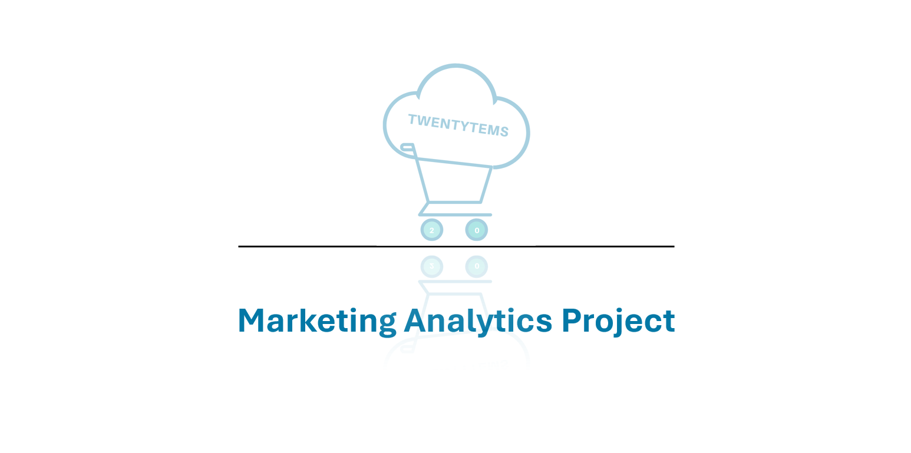
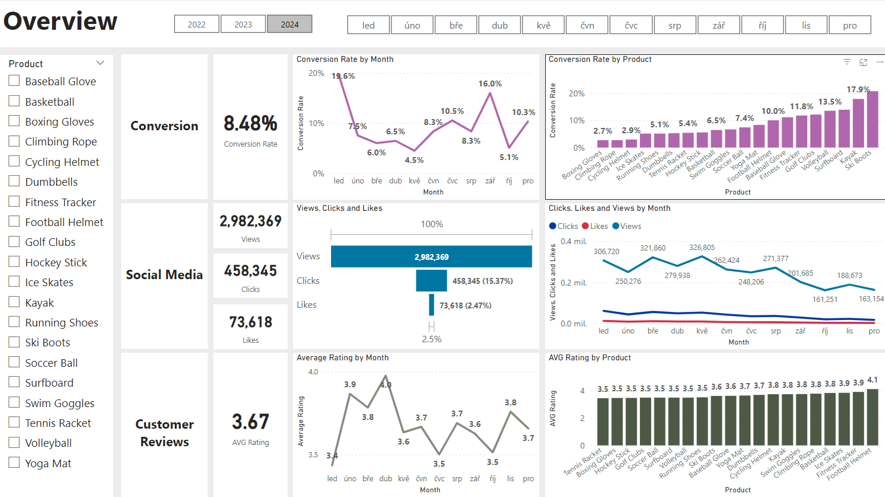
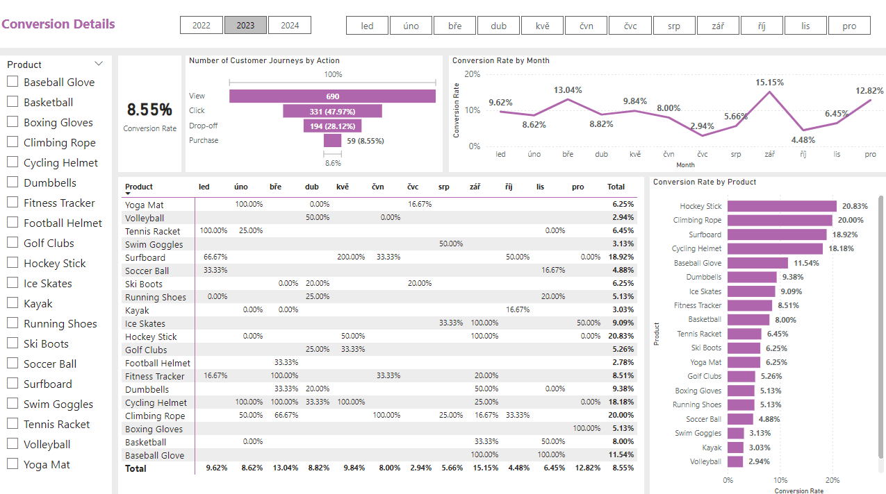
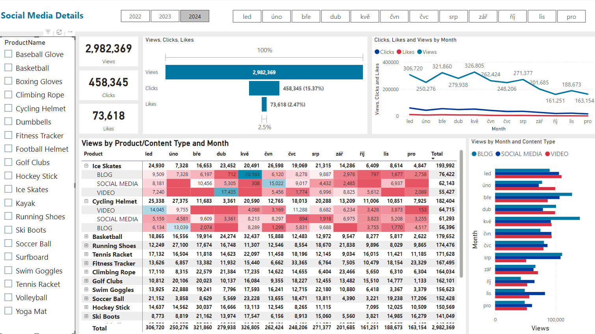
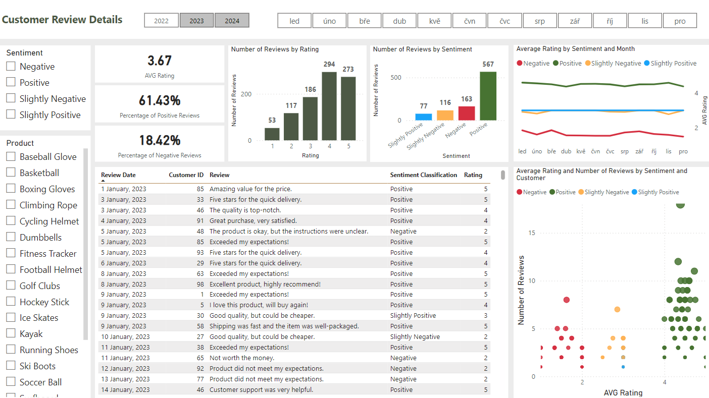
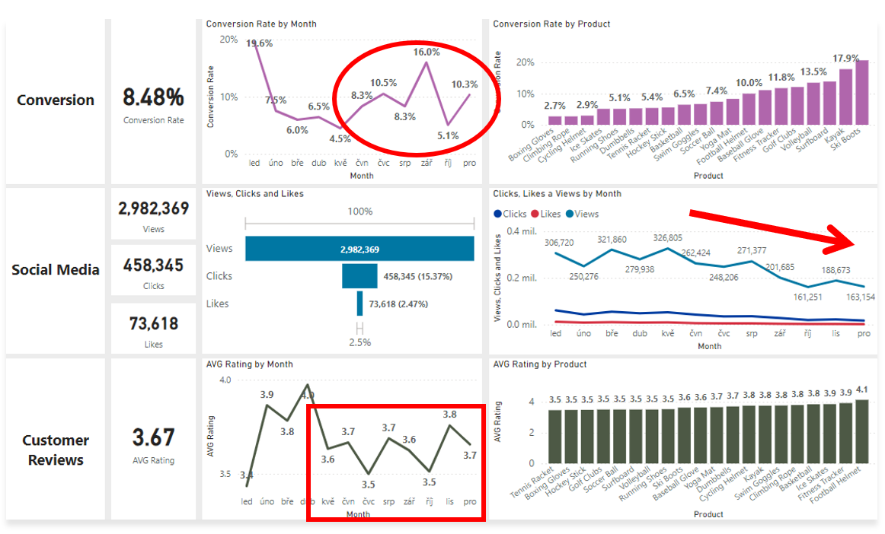
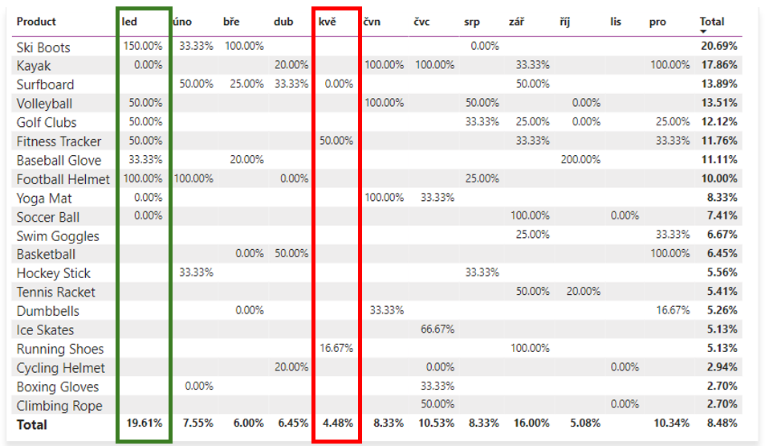
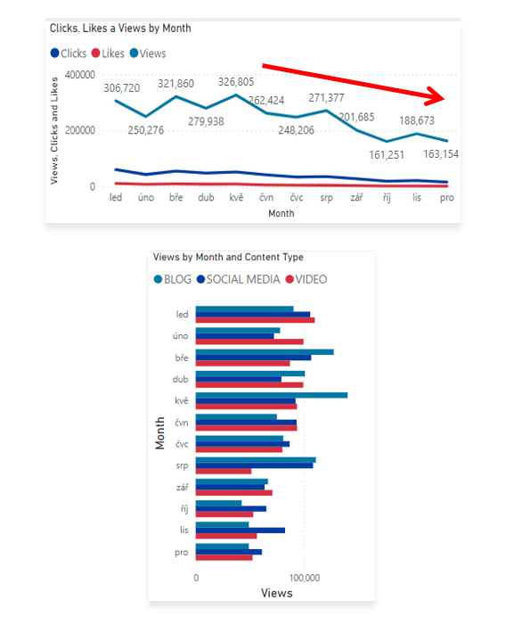
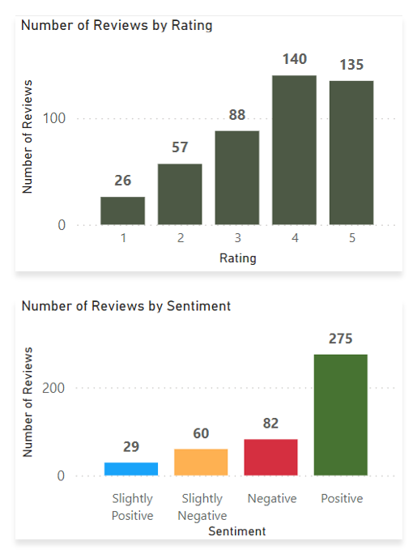

<h1 style="text-align: center;">Analýza chování a interakce zákazníků online obchodu</h1> 

  

## Zadání

### Scénář:  
Část naší společnosti, online obchod Twentytems, zažívá pokles v počtu dokončených nákupů. Navzdory spuštění několika nových online marketingových kampaní se míra konverze (tj. podíl návštěvníků online obchodu, kteří uskuteční nákup) stále snižuje. Marketingové oddělení se na nás obratilo s žádostí o pomoc při provedení podrobné analýzy za účelem identifikace oblastí pro zlepšení jejich marketingových strategií.

### Hlavní body:  
- Snižující se míra konverze: Máme nižší podíl návštěvníků webu, kteří dokončí nákup.
- Snížení zákaznické angažovanosti: Interakce s online obchodem a marketingovými materiály poklesly.
- Je důležité provést analýzu zpětné vazby zákazníků: Získání náhledu na názory zákazníků na naše produkty a služby je nezbytné pro zvýšení angažovanosti a míry konverze.
- Vysoké marketingové náklady: Významné výdaje na marketingové aktivity nepřinášejí očekávané výsledky.

## Návrh řešení
Abychom marketingovému oddělení mohli poskytnout analýzu založenou na datech, musíme nejprve definovat relevantní metriky a KPI. Naším cílem je vytvořit dashboard, který zvýrazní klíčové oblasti pro zlepšení a umožní získání hlubších poznatků o našich zákaznících.

### Klíčové ukazatele výkonnosti (KPI): 

- Míra konverze: Podíl návštěvníků webu, kteří dokončí nákup
- Míra angažovanosti zákazníků: Úroveň interakce s marketingovým obsahem (kliknutí, lajky, komentáře)
- Hodnocení zpětné vazby zákazníků: Průměrné hodnocení získané z recenzí našich zákazníků

### Cíle

#### Zvýšení míry konverze:

- Cíl: Identifikovat faktory, které ovlivňují míru konverze a následně navrhnout způsoby pro zlepšení.
- Související KPI: Míra konverze.
- Poznatky: Zvýraznit kritické body v "customer journey". Zjistit, kde návštěvníci často opouštějí proces, a doporučit strategii pro optimalizaci.

####  Zvýšení angažovanosti zákazníků:

- Cíl: Určit, které typy obsahu generují nejvyšší angažovanost.
- Související KPI: Míra angažovanosti zákazníků.
- Poznatky: Analyzovat míru interakcí u různých formátů marketingového obsahu a vyvinout efektivnější strategie pro tvorbu obsahu.

#### Vylepšení hodnocení zpětné vazby zákazníků:

- Cíl: Porozumět běžným tématům v recenzích zákazníků a poskytnout doporučení.
- Související KPI: Hodnocení zpětné vazby zákazníků.
- Poznatky: Identifikovat opakující se pozitivní i negativní zpětnou vazbu. Tato analýza může pomoci s vylepšováním našich produktů a služeb (a tím pádem i se zlepšením zákaznické zkušenosti).

## Ukázka Finálních Dashboardů

Dashboardy v Power BI obsahují **celkový přehled** a dále samostatné pohledy pro každou z oblastí, tedy podrobnosti o **míře konverze**, o **sociálních médiích** i o **ecenzích zákazníků** online obchodu.

- **Celkový Přehled**  

  

- **Analýza míry konverze**  

  

- **Přehled o socíálních médiích**

  

- **Přehled o zpětné vazbě**

  

## Analýza

### Přehled za rok 2024

- **Nižší míra konverze:**  
Míra konverze vykázala silné oživení v prosinci, kdy dosáhla hodnoty 10,3 % (i přes výrazný pokles na 5,1 % v říjnu roku 2024). Je však důležité upozornit na výrazný pokles roční míry konverze oproti předchozímu období, především tedy oproti roku 2022. Průměrná míra konverze v roce 2022 byla totiž téměř 11,6 %. V roce 2023 pak poklesla na 8,55 % a tento rok pokračoval sestupný trend mírným poklesem na 8,48 %.  

- **Snížená angažovanost zákazníků:**
Došlo k poklesu celkové angažovanosti na sociálních médiích, přičemž všechny metriky angažovanosti klesaly především ve druhé polovině roku.
I když jsou kliknutí a lajky nízké v porovnání s počty zhlédnutí, míra prokliku dosahuje hodnoty 15,37 %, což znamená, že zapojení uživatelé stále efektivně interagují. Ačkoliv je celkový trend spíše klesající, přeci jen lze zaznamenat pozitivní trend V porovnání s předchozím rokem, kdy zaznamenáváme oproti roku 2023 absolutní nárůst ve všech zmíněných metrikách (lajky, kliknutí i zhlédnutí).  

- **Konzistentní hodnocení zákazníků:**
Hodnocení zákazníků je stále nadprůměrné. Pohybuje se přibližně na hodnotě 3,7 po celý rok.
I když průměrné hodnocení zůstává stabilní, nedosahuje cílové hodnoty 4,0, což naznačuje potřebu zaměřit se na spokojenost zákazníků, zejména u produktů, které mají hodnocení nižší než je 3,5.

  

### Lower Conversion Rates

- **General Conversion Trend:**  
Throughout the year, conversion rates varied, with the highest numbers of products converting most effectively in January and September. Especially January is the most prominent month over the targeted years. We also observed a higher conversion rate in July and December, likely due to seasonal peaks during the summer and the Christmas holidays for some products. While some products experienced strong seasonal peaks, there is potential to improve conversions in lower-performing months through targeted actions.

- **Lowest Conversion Month:**  
May experienced the lowest conversion rate, approximately 4.5%, with no products notably excelling in conversion. This suggests a possible need to re-evaluate our marketing strategies or promotions during this time to enhance our performance.

- **Highest Conversion Rates:**  
January achieved the highest overall conversion rate of 19.6%, largely thanks to the Ski Boots, which boasted an impressive conversion rate of 150%. This reflects a robust beginning to the year, likely driven by seasonal demand and successful marketing efforts. It may be worthwhile to consider adding more winter skiing equipment to further support sales during these months, given the strong performance of the Ski Boots.  

  

### Reduced Customer Engagement

- **Declining Views:**  
The number of views steadily increased throughout 2024, peaking in March and May. Unfortunately, after the end of August, we experienced a gradual decline, during which we were unable to approach the 200,000 views mark (except for September).  This reflects a significant decrease in audience engagement during the last third of the year.  

- **Low Interaction Rates:**  
Clicks and likes have consistently been low in relation to views, indicating a need for more compelling content or more effective calls to action.  

- **Content Type Performance:**  
The blog content generated the highest number of views, particularly in March, May, and August. Social media and video content reached high levels in January (for both social media and video content) and in March and August (for social media only). On the other hand, it is evident that in the first half of the year, videos maintained a stable number of views, and overall, all content types were highly sought after during that period. Unfortunately, this cannot be said for the period following the summer holidays. Since then, there has been a continuous decline in views across all content. All of this indicates that marketing needs to post more compelling content or reconsider more effective ways to engage the audience.  

  

### Consistent Customer Feedback

- **Customer Ratings Distribution:**  
Most customer reviews fall within the higher rating categories, featuring 135 reviews at 5 stars and 140 reviews at 4 stars, suggesting generally favorable feedback. In contrast, lower ratings (1 and 2 stars) represent a smaller share, with 57 reviews at 2 stars and 26 reviews at 1 star. The third largest number of customer reviews (88) reflects a neutral perspective, rated at 3 stars. Notably, the percentage of negative reviews has gradually increased, from 14.32% in 2022 to 18.61% in 2024. In contrast, the percentage of positive reviews has remained steady over the targeted period.  

- **Sentiment Analysis:**  
Positive sentiment dominates with 275 reviews, reflecting a generally satisfied customer base. Negative sentiment is present in 82 reviews. Smaller number of slightly positive or negative sentiments, suggesting some areas for improvement, but overall, very strong customer approval. It is certainly interesting that the sentiment text analysis categorized one of the 2-star reviews as slightly negative, suggesting an opportunity to analyze this and similar reviews to identify potential improvements in customer satisfaction.

- **Opportunity for Improvement:**  
The existence of both positive and negative sentiments indicates that there are chances to transform these mixed experiences into more distinctly positive ones, which could enhance overall ratings. By tackling the specific issues highlighted in the mixed reviews, customer satisfaction could be improved.  

  

## Conclusion

### Goals Summary

#### Boost Conversion Rates:

- **Goal:** Identify factors impacting the conversion rate and offer suggestions for enhancement.  
- **Insight:** Highlight critical points in the customer journey where visitors tend to abandon the process and recommend strategies to refine the conversion funnel.  

#### Enhance Customer Engagement:

- **Goal:** Determine which types of content generate the highest engagement.  
- **Insight:** Analyze interaction rates across various marketing content formats to develop more effective content strategies.

#### Improve Customer Feedback Scores

- **Goal:** Understand common themes in customer reviews and provide recommendations.  
- **Insight:** Identify recurring positive and negative feedback to guide product and service improvements.  

These goals collectively aim to enhance the overall customer experience and drive business growth.  

### Recommendations

#### Boost Conversion Rates:

- **Focus on High-Performing Product Categories:**  
Direct marketing resources toward products that have shown strong conversion rates, including Ski Boots, Kayaks, Surfboards, and other items with conversion rates exceeding 10%. Launch seasonal promotions or personalized campaigns during key months   (such as January, September, and prior to summer and the Christmas holiday season) to take advantage of these trends. Furthermore, consider expanding the winter skiing equipment range during the winter months to boost sales and improve conversions in lower-performing months through targeted initiatives. Additionally, implementing a loyalty program could further encourage repeat purchases and foster customer retention.  

#### Enhance Customer Engagement:

- **Optimize Content Strategy:**  
To reverse the trend of decreasing views and low levels of customer engagement, consider incorporating more appealing content formats, such as interactive videos. Additionally, enhance user interaction by optimizing the placement of calls to action in social media posts and blog articles, particularly during traditionally low-engagement periods (September to December). You might also focus on increasing the use of platforms like Instagram and TikTok to further enhance customer engagement.  

#### Improve Customer Feedback Scores:

- **Target Mixed and Negative Feedback:**  
Set up a feedback system to examine mixed and negative reviews for common issues. Create actionable plans to resolve these concerns. Additionally, reaching out to dissatisfied customers to address their grievances may encourage them to re-evaluate their experience, with the ultimate goal of improving average ratings to 4 and above.
